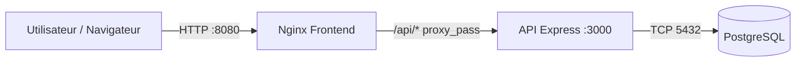

# VitalSync — E6 CI/CD conteneurisée

Projet minimaliste pour mettre en place une chaîne **CI/CD** autour d’une application conteneurisée :
- **backend** : API Node.js/Express (port **3000**)
- **frontend** : page statique servie par **Nginx** (port **8080** en local)
- **database** : PostgreSQL (volume persistant)

## Architecture (schéma)



## Prérequis
- Docker Desktop (avec Docker Compose)
- Node.js 20+ (utile pour exécuter `npm test` en local)

## Lancer en local (Docker Compose)

1) Créer `.env` à partir de l’exemple :

```bash
cp .env.example .env
```

2) Démarrer :

```bash
docker compose up --build
```

3) Vérifications :
- Front : `http://localhost:8080`
- API (direct) : `http://localhost:3000/health`
- API (via proxy Nginx) : `http://localhost:8080/api/health`

## Tests (Jest) et lint (ESLint)

Depuis `backend/` :

```bash
npm ci
npm test
npm run lint
```

## CI/CD (GitHub Actions)

Workflow : `.github/workflows/ci-cd.yml`
- **Lint & Tests** : `npm ci` + `npm test` + `npm run lint` (backend)
- **Build & Push** : build + push images backend/frontend sur **GHCR**, taggées avec le **SHA** du commit
- **Staging** : `docker compose up -d` puis healthcheck HTTP sur `http://localhost:3000/health` (échec si non OK)

## Kubernetes (manifestes)

Dossier `k8s/` :
- `backend-deployment.yaml` (2 réplicas + livenessProbe `/health`)
- `backend-service.yaml` (ClusterIP)
- `backend-secret.yaml` (Secret mot de passe DB)
- `frontend-deployment.yaml` + `frontend-service.yaml`
- `ingress.yaml` (exposition du frontend)

